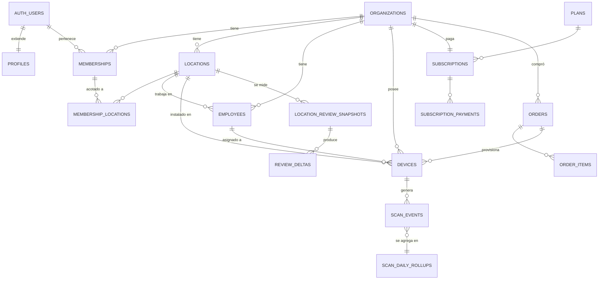

# Linkstar — Esquema multi-tenant

Migraciones para Supabase (PostgreSQL 15+). Aplicar **en orden**:

```bash
supabase db reset            # local
# o, contra el proyecto remoto:
supabase db push
```

Desde la raíz del monorepo son `npm run db:reset`, `npm run db:push` y `npm run db:status`
(`supabase migration list`, compara local contra remoto).

| Archivo | Contenido |
|---|---|
| `0000_drop_legacy_orders.sql` | Borra la tabla `orders` vieja del sitio de venta (0 filas en prod, verificado) |
| `0001_extensions_types_helpers.sql` | Extensiones, esquema `private`, enums, generadores de IDs, hash de IP |
| `0002_tenancy.sql` | `organizations`, `profiles`, `memberships`, `invitations`, trigger `on_auth_user_created` |
| `0003_catalog.sql` | `locations`, `employees`, `devices`, alcance por sucursal (`membership_locations`) |
| `0004_events_and_metrics.sql` | `scan_events`, `scan_daily_rollups`, snapshots de reseñas, auditoría |
| `0005_billing_and_orders.sql` | `plans`, `subscriptions`, pagos, `orders` del sitio de venta, webhooks |
| `0006_rls.sql` | **Todas las políticas de Row Level Security** |
| `0007_functions_and_jobs.sql` | `resolve_scan`, `claim_device`, límites de plan, jobs nocturnos |
| `0008_dashboard_views.sql` | Vistas del dashboard (con `security_invoker`) |
| `0009_webhook_rpc.sql` | RPCs del webhook de Mercado Pago (`record_webhook_event` y compañía) |
| `0010_profile_login_tracking.sql` | `profiles.last_login_at` (lo escribe `POST /api/auth/login-event`) |
| `0011_scan_medium.sql` | `scan_events.medium` (`qr`/`nfc`) y la sobrecarga de `resolve_scan` con `p_medium` |
| `0012_rebuild_today_rollup_rpc.sql` | `public.rebuild_today_rollup()`, wrapper para recalcular un día a demanda |

Si una migración se aplicó a mano fuera de la CLI (ya pasó con `0010`),
`supabase migration repair --status applied <version>` arregla el historial sin volver a correr el SQL.

---

## Modelo de datos



`scan_events.medium` (`0011`) guarda con qué se tocó el expositor: `qr`, `nfc` o `null`. Sale del sufijo
`?s=q` / `?s=n` de la URL, que se define al imprimir el QR o grabar el chip — mismo `public_id`, distinta
URL según el soporte. Los rollups **no** agrupan por `medium`: la columna es aditiva, para consultas
ad-hoc.

---

## Las seis decisiones que importan

### 1. El tenant es la organización, no el local
Un cliente con cinco sucursales es **una** organización con cinco `locations`. Si hicieras que cada local fuera un tenant, no podrías mostrarle al dueño el comparativo entre sucursales, que es justamente lo que justifica el plan más caro.

### 2. La atribución se guarda como *snapshot*, no por JOIN
`scan_events` copia `location_id`, `employee_id` y `kind` en el momento del escaneo. Si mañana el cliente reasigna un expositor del mozo Juan al mozo Pedro, un JOIN reescribiría toda la historia y Juan aparecería con cero reseñas de golpe. Este es el error más caro de deshacer una vez que tenés datos en producción.

### 3. El dashboard nunca lee `scan_events`
Lee `scan_daily_rollups`, que se reconstruye a la madrugada con `DELETE + INSERT` por día (idempotente: podés recalcular cualquier día las veces que quieras). Es la diferencia entre quedarte en los USD 25 de Supabase o empezar a pagar add-ons de compute.

### 4. `resolve_scan` no se le otorga a `anon`
La anon key de Supabase es pública por diseño: está en el bundle de tu SPA. Si `anon` pudiera ejecutar la función, cualquiera podría inflar o ensuciar las métricas de cualquier cliente conociendo un `public_id`. La ejecuta sólo el Worker/Edge Function de redirección, con `service_role`.

### 5. Los dispositivos no se crean desde la app
Se fabrican con `status = 'unassigned'` y un `claim_code` impreso en la base, y el cliente los vincula con `claim_device()`. Si `devices` tuviera política de INSERT para el cliente, cualquiera se daría de alta expositores infinitos y saltearía los límites del plan.

### 6. Toda vista lleva `security_invoker = on`
Sin eso, una vista corre con los permisos de quien la creó e **ignora el RLS de las tablas de abajo**. Es la fuga multi-tenant más silenciosa que existe: el RLS está perfecto, los tests sobre tablas pasan, y la vista devuelve los datos de todos los clientes.

---

## Sobre las "reseñas estimadas"

Conviene tenerlo claro antes de venderlo: **Google no avisa cuándo alguien deja una reseña** ni permite atribuirla a un escaneo. No hay callback, no hay webhook, no hay forma de saberlo con certeza.

Lo único medible de verdad es el **conteo total de reseñas por ubicación**, consultado diariamente vía Google Business Profile API (o Places API) y guardado en `location_review_snapshots`. La diferencia día contra día son las reseñas nuevas (`review_deltas`).

Eso te da atribución real **por sucursal y por día**. Por empleado o por dispositivo es necesariamente un prorrateo según los escaneos únicos. Etiquetalo como "estimado" en la UI —ya lo hacés— y explicalo en la documentación del producto: si un cliente descubre solo que el número es una estimación, perdés la confianza de golpe.

---

## Quién consume el esquema (y qué falta)

Este README se escribió cuando el único frontend era un SPA de Vite sin servidor y las tres piezas de abajo
iban a ser Edge Functions. Hoy el monorepo tiene un backend propio, `services/api`, y dos de las tres ya
viven ahí:

| Pieza | Estado | Dónde |
|---|---|---|
| `redirect` | ✅ Hecho | `services/api/routes/redirect.js` — `GET /d/:publicId`, llama `resolve_scan()` con `p_medium`, 302 |
| `mp-webhook` | ✅ Hecho | `services/api/routes/webhooks.js` — `POST /api/webhook/mercadopago` |
| `sync-reviews` | ❌ **Falta** | Job diario: consulta Google por cada `google_place_id` y guarda el snapshot. Necesita `SERVICE_ROLE_KEY` + `GOOGLE_API_KEY` |

Mientras `sync-reviews` no exista, `location_review_snapshots` queda vacía y todo lo que dependa de
`review_deltas` (las "reseñas estimadas" de las vistas de `0008`) no tiene de dónde salir.

Las tres reglas del webhook de Mercado Pago **ya están implementadas** en `routes/webhooks.js` — quedan
acá escritas porque son fáciles de romper en un refactor:

1. **Validá la firma `x-signature`** antes que nada, y fallá cerrado si `MP_WEBHOOK_SECRET` no está seteado. El endpoint es público; sin validación, cualquiera puede activarse una suscripción con un `curl`.
2. **Respondé `200` en menos de 22 segundos**, antes de procesar. Guardá el payload y procesá aparte.
3. **Insertá en `private.webhook_events` con la clave única `(provider, topic, external_id)`** (vía `record_webhook_event()`, `0009`). Mercado Pago reintenta, y a veces manda la misma notificación dos veces aunque hayas respondido bien. Sin idempotencia, un reintento te duplica un pago o reactiva una suscripción cancelada.

El otro consumidor es `apps/dashboard`, que lee **sólo** las vistas de `0008` con la anon key + la sesión
del usuario (nunca `scan_events` ni `scan_daily_rollups` directo — decisión 3).

---

## Antes de ir a producción

Todavía no salimos a la venta: no hay tenants reales, así que el esquema puede cambiar de forma sin
plan de migración de datos. Esta lista es lo que sí hay que tener antes de vender la primera suscripción.

- [ ] Correr `tests/rls_isolation.sql` (verifica que un tenant no vea al otro) — también antes de cada cambio de RLS
- [ ] Habilitar `pg_cron` y descomentar los `cron.schedule` de `0007`
- [ ] Construir `sync-reviews`, o el dashboard no tiene reseñas reales que mostrar
- [ ] Cargar precios reales y `mp_preapproval_plan_id` en `plans` (hoy los precios están hardcodeados en el front — ver "Pricing" en `CLAUDE.md`)
- [ ] Activar backups diarios (plan Pro de Supabase)
- [ ] Rotar `private.app_secrets.ip_pepper` **nunca**: si lo cambiás, se rompe la deduplicación histórica
- [ ] Verificar en el panel de Supabase que ninguna tabla aparezca con el aviso "RLS disabled"
