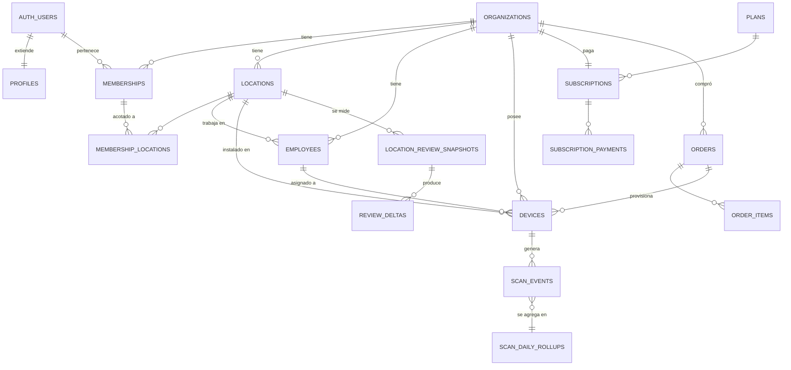

# Linkstar — Esquema multi-tenant

Migraciones para Supabase (PostgreSQL 15+). Aplicar **en orden**:

```bash
supabase db reset            # local
# o, contra el proyecto remoto:
supabase db push
```

Desde la raíz del monorepo son `npm run db:reset`, `npm run db:push` y `npm run db:status`
(`supabase migration list`, compara local contra remoto).

| Archivo | Contenido |
|---|---|
| `0000_drop_legacy_orders.sql` | Borra la tabla `orders` vieja del sitio de venta (0 filas en prod, verificado) |
| `0001_extensions_types_helpers.sql` | Extensiones, esquema `private`, enums, generadores de IDs, hash de IP |
| `0002_tenancy.sql` | `organizations`, `profiles`, `memberships`, `invitations`, trigger `on_auth_user_created` |
| `0003_catalog.sql` | `locations`, `employees`, `devices`, alcance por sucursal (`membership_locations`) |
| `0004_events_and_metrics.sql` | `scan_events`, `scan_daily_rollups`, snapshots de reseñas, auditoría |
| `0005_billing_and_orders.sql` | `plans`, `subscriptions`, pagos, `orders` del sitio de venta, webhooks |
| `0006_rls.sql` | **Todas las políticas de Row Level Security** |
| `0007_functions_and_jobs.sql` | `resolve_scan`, `claim_device`, límites de plan, jobs nocturnos |
| `0008_dashboard_views.sql` | Vistas del dashboard (con `security_invoker`) |
| `0009_webhook_rpc.sql` | RPCs del webhook de Mercado Pago (`record_webhook_event` y compañía) |
| `0010_profile_login_tracking.sql` | `profiles.last_login_at` (lo escribe `POST /api/auth/login-event`) |
| `0011_scan_medium.sql` | `scan_events.medium` (`qr`/`nfc`) y la sobrecarga de `resolve_scan` con `p_medium` |
| `0012_rebuild_today_rollup_rpc.sql` | `public.rebuild_today_rollup()`, wrapper para recalcular un día a demanda |
| `0013_subscription_onboarding.sql` | Catálogo real de `plans`, `plan_selected_at`, `my_org_context()`, `select_free_plan()`, RPCs de preapproval |
| `0014_enforce_subscription_access.sql` | `private.orgs_with_access()` y el RLS que exige plan pago para leer y escribir |
| `0015_free_plan_requires_device.sql` | `org_is_activated()` — el plan gratis además necesita un expositor vinculado. **Revertida por la `0022`** |
| `0016_entity_daily_series.sql` | Serie diaria por dispositivo / local / empleado, con `human_scans` y `bot_scans` |
| `0017_fix_subscription_rpcs.sql` | Correctiva: reaplica los dos arreglos del `0013` que nunca llegaron a Postgres |
| `0018_human_scans_in_dashboard_views.sql` | `human_scans` / `bot_scans` en las cinco vistas del `0008` que agregan rollups |
| `0019_fix_check_same_org_trigger.sql` | Correctiva: `insert into employees` fallaba **siempre** desde el `0003` |
| `0020_team_invitations.sql` | `invite_member()`, `list_org_members()`, `set_member_role()`, `private.active_org_id()` y el límite de `max_members` |
| `0021_redirect_fallback_domain.sql` | Correctiva: el fallback de `resolve_scan()` apuntaba a `linkstar.com.ar`, un dominio que nunca se registró |
| `0022_free_plan_without_device.sql` | Decisión de producto: el plan gratis **ya no** exige expositor vinculado. `org_is_activated()` queda como alias de `org_has_access()` |
| `0023_notifications.sql` | Preferencias de avisos por organización, registro de envíos y `pending_notifications()` (expositor inactivo, resumen semanal) |
| `0024_google_business_profile.sql` | Conexión OAuth con Google, refresh token cifrado, `google_locations` / `google_reviews` y las RPC de `sync-reviews` |
| `0025_google_reviews_only_linked.sql` | Reseñas sólo de fichas vinculadas a una sucursal viva, y la poda que lo hace cumplir |
| `0026_google_review_replies.sql` | Responder reseñas: `google_review_reply_target()` (quién responde qué) y `google_record_reply()` |
| `0027_org_switcher.sql` | Selector de organización: `list_my_organizations()`, `set_active_organization()`, y `accept_invitation()` deja activa la organización aceptada |
| `0028_daily_jobs_and_card_attribution.sql` | `run_expire_subscriptions()` para el job diario, y el trigger que sólo deja asignar un empleado a una tarjeta personal (`nfc_card`) — decisión 11 |
| `0029_business_features_and_google_metrics.sql` | `private.org_has_business()`, métricas de la ficha (`google_daily_metrics`, sólo por `google_metrics_daily()`) y palabras de búsqueda (`google_search_keywords`, Business) |
| `0030_google_profile_protection.sql` | `google_location_write_target()` (quién escribe en una ficha), protección de ficha (`google_profile_changes`, Business) y `org_alert_recipient()` |
| `0031_google_posts.sql` | `google_location_read_target()`, publicaciones (`google_posts`, cupo de 1 por mes en gratis) y el bucket público `google-post-media` |
| `0032_free_plan_fallback_and_org_tiebreak.sql` | `select_free_plan()` deja volver a gratis a una organización sin acceso (Business cancelado, `trial` viejo) y avisa `paid_plan_active` en vez de no hacer nada; desempate de la organización activa |
| `0033_review_analysis.sql` | Análisis de reseñas con IA (fase 5): `google_review_analysis`, `v_review_analysis` y las dos RPC `service_role` del analizador |
| `0034_retention_by_plan.sql` | El historial de cada plan (decisión 3): corte de lectura en escaneos, rollups, reseñas estimadas, métricas y búsquedas; purga de escaneos crudos (`run_purge_scan_events()`); `rebuild_today_rollup()` no reconstruye días ya purgados |

> **Producción tiene hasta la `0033`** (8 oct 2026). **La `0034` está probada en local pero no aplicada**
> en ningún proyecto remoto: hay que subirla **antes** de mergear a `main` el API que llama a
> `run_purge_scan_events()`. Ojo con el vínculo del CLI: en la máquina de Santiago apunta al proyecto de
> pruebas y en otras a producción — revisá `.temp/project-ref` antes de cualquier `db:push`.

> **Al aplicar la `0022` hay que actualizar `tests/rls_isolation.sql` en el mismo cambio.** El test
> assertea la regla de la `0015` —"plan gratis sin expositor: `org_has_access` sí,
> `org_is_activated` no"— y esa condición deja de ser cierta, así que el test falla. No es un
> problema del test: es la regla que cambió.

Si una migración se aplicó a mano fuera de la CLI (ya pasó con `0010`),
`supabase migration repair --status applied <version>` arregla el historial sin volver a correr el SQL.

### Windows: `supabase start` falla con "ports are not available"

Si el arranque local muere con

```
failed to start docker container "supabase_db_...": ports are not available:
exposing port TCP 0.0.0.0:54322 -> ...: bind: An attempt was made to access a
socket in a way forbidden by its access permissions.
```

no es Docker ni el firewall: Hyper-V/WSL reserva rangos de puertos dinámicos al
arrancar, y **los puertos por defecto de Supabase (54320–54329) caen enteros
adentro**. Se ven con:

```powershell
netsh interface ipv4 show excludedportrange protocol=tcp
```

El rango reservado cambia en cada reinicio de Windows, así que no tiene sentido
fijar otros puertos en `config.toml` — es un archivo compartido y lo que sirve en
una máquina rompe en la otra. La salida es remapearlos **temporalmente** (por
ejemplo 543xx → 553xx), correr lo que haya que correr, y revertir el archivo:

```bash
git checkout -- packages/database/supabase/config.toml
```

Verificado el 15/08/2026 en Windows 10: con ese remapeo `supabase start`,
`db reset` (0000 → 0019) y `tests/rls_isolation.sql` corren completos.

---

## Modelo de datos


```mermaid
erDiagram
    ORGANIZATIONS ||--o{ MEMBERSHIPS : "tiene"
    ORGANIZATIONS ||--o{ LOCATIONS : "tiene"
    ORGANIZATIONS ||--o{ EMPLOYEES : "tiene"
    ORGANIZATIONS ||--o{ DEVICES : "posee"
    ORGANIZATIONS ||--|| SUBSCRIPTIONS : "paga"
    ORGANIZATIONS ||--o{ ORDERS : "compró"

    AUTH_USERS ||--|| PROFILES : "extiende"
    AUTH_USERS ||--o{ MEMBERSHIPS : "pertenece"

    MEMBERSHIPS ||--o{ MEMBERSHIP_LOCATIONS : "acotado a"
    LOCATIONS ||--o{ MEMBERSHIP_LOCATIONS : ""

    LOCATIONS ||--o{ EMPLOYEES : "trabaja en"
    LOCATIONS ||--o{ DEVICES : "instalado en"
    EMPLOYEES ||--o{ DEVICES : "asignado a"

    DEVICES ||--o{ SCAN_EVENTS : "genera"
    SCAN_EVENTS }o--|| SCAN_DAILY_ROLLUPS : "se agrega en"

    LOCATIONS ||--o{ LOCATION_REVIEW_SNAPSHOTS : "se mide"
    LOCATION_REVIEW_SNAPSHOTS ||--o{ REVIEW_DELTAS : "produce"

    PLANS ||--o{ SUBSCRIPTIONS : ""
    SUBSCRIPTIONS ||--o{ SUBSCRIPTION_PAYMENTS : ""
    ORDERS ||--o{ ORDER_ITEMS : ""
    ORDERS ||--o{ DEVICES : "provisiona"
```

`scan_events.medium` (`0011`) guarda con qué se tocó el expositor: `qr`, `nfc` o `null`. Sale del sufijo
`?s=q` / `?s=n` de la URL, que se define al imprimir el QR o grabar el chip — mismo `public_id`, distinta
URL según el soporte. Los rollups **no** agrupan por `medium`: la columna es aditiva, para consultas
ad-hoc.

---

## Las seis decisiones que importan

### 1. El tenant es la organización, no el local
Un cliente con cinco sucursales es **una** organización con cinco `locations`. Si hicieras que cada local fuera un tenant, no podrías mostrarle al dueño el comparativo entre sucursales, que es justamente lo que justifica el plan más caro.

### 2. La atribución se guarda como *snapshot*, no por JOIN
`scan_events` copia `location_id`, `employee_id` y `kind` en el momento del escaneo. Si mañana el cliente reasigna un expositor del mozo Juan al mozo Pedro, un JOIN reescribiría toda la historia y Juan aparecería con cero reseñas de golpe. Este es el error más caro de deshacer una vez que tenés datos en producción.

### 3. El dashboard nunca lee `scan_events`
Lee `scan_daily_rollups`, que se reconstruye a la madrugada con `DELETE + INSERT` por día (idempotente: podés recalcular cualquier día las veces que quieras). Es la diferencia entre quedarte en los USD 25 de Supabase o empezar a pagar add-ons de compute.

### 4. `resolve_scan` no se le otorga a `anon`
La anon key de Supabase es pública por diseño: está en el bundle de tu SPA. Si `anon` pudiera ejecutar la función, cualquiera podría inflar o ensuciar las métricas de cualquier cliente conociendo un `public_id`. La ejecuta sólo el Worker/Edge Function de redirección, con `service_role`.

### 5. Los dispositivos no se crean desde la app
Se fabrican con `status = 'unassigned'` y un `claim_code` impreso en la base, y el cliente los vincula con `claim_device()`. Si `devices` tuviera política de INSERT para el cliente, cualquiera se daría de alta expositores infinitos y saltearía los límites del plan.

### 6. Toda vista lleva `security_invoker = on`
Sin eso, una vista corre con los permisos de quien la creó e **ignora el RLS de las tablas de abajo**. Es la fuga multi-tenant más silenciosa que existe: el RLS está perfecto, los tests sobre tablas pasan, y la vista devuelve los datos de todos los clientes.

---

## Sobre las "reseñas estimadas"

Conviene tenerlo claro antes de venderlo: **Google no avisa cuándo alguien deja una reseña** ni permite atribuirla a un escaneo. No hay callback, no hay webhook, no hay forma de saberlo con certeza.

Lo único medible de verdad es el **conteo total de reseñas por ubicación**, consultado diariamente vía Google Business Profile API (o Places API) y guardado en `location_review_snapshots`. La diferencia día contra día son las reseñas nuevas (`review_deltas`).

Eso te da atribución real **por sucursal y por día**. Por empleado o por dispositivo es necesariamente un prorrateo según los escaneos únicos. Etiquetalo como "estimado" en la UI —ya lo hacés— y explicalo en la documentación del producto: si un cliente descubre solo que el número es una estimación, perdés la confianza de golpe.

---

## Quién consume el esquema (y qué falta)

Este README se escribió cuando el único frontend era un SPA de Vite sin servidor y las tres piezas de abajo
iban a ser Edge Functions. Hoy el monorepo tiene un backend propio, `services/api`, y dos de las tres ya
viven ahí:

| Pieza | Estado | Dónde |
|---|---|---|
| `redirect` | ✅ Hecho | `services/api/routes/redirect.js` — `GET /d/:publicId`, llama `resolve_scan()` con `p_medium`, 302 |
| `mp-webhook` | ✅ Hecho | `services/api/routes/webhooks.js` — `POST /api/webhook/mercadopago` |
| `sync-reviews` → `sync-google` | ✅ Programado | `services/api/scripts/sync-google.js` (`npm run sync-google`), dentro del job diario de Railway (`npm run daily`). Lee con OAuth, no con API key. Desde la fase 4.6 lee también métricas y palabras de búsqueda, y revisa la protección de ficha (Business). Tablas y RPC en `0024`, `0029` y `0030` |

`sync-google` no puede ser un `pg_cron`: habla con Google y descifra el refresh token con
`GOOGLE_TOKEN_ENC_KEY`, que vive sólo en `services/api`. Corre en el job diario del API. Hasta que un
cliente conecte su ficha y la vincule a una sucursal, `location_review_snapshots` queda vacía y todo lo
que dependa de `review_deltas` (las "reseñas estimadas" de las vistas de `0008`) no tiene de dónde salir.

El mismo job diario corre antes `scripts/rebuild-rollups.js`: reconstruye `scan_daily_rollups` de ayer y
de hoy (`rebuild_today_rollup`, `0012`) y vence suscripciones (`run_expire_subscriptions`, `0028`). Es lo
que hacían —en el papel— los `cron.schedule` comentados de la `0007`; sin eso el panel mostraba los
escaneos en cero.

Lo de `0029`–`0031` que es fácil de romper:

- **Lo Business se corta en la base, no en la pantalla.** `private.org_has_business()` decide. El
  desglose de impresiones por plataforma llega en `null` para el plan gratis porque
  `google_daily_metrics` **no tiene select directo**: se lee sólo por `google_metrics_daily()`. Darle una
  política de select a esa tabla abre el corte.
- **Quién escribe en una ficha lo decide la base** (`google_location_write_target`, misma regla que
  responder reseñas). Para leerla en vivo, `google_location_read_target` (un viewer sí).
- **El cupo de publicaciones se reserva antes de llamar a Google** (`google_post_reserve`, con la
  organización bloqueada). Borrar una publicación no devuelve el cupo.
- **El bucket `google-post-media` es público a propósito**: Google baja la foto desde la URL. Cada
  organización escribe sólo en su carpeta (`<org_id>/…`).
- **`'profile_changed'` se agregó a `notification_kind` en la `0030` y no se usa en la misma migración**:
  un valor de enum nuevo no se puede usar en la transacción que lo crea.

Lo de `0024` que es fácil de romper:

- **El refresh token no se lee desde el cliente, ni siquiera la owner.** Vive en
  `private.google_oauth_tokens` (fuera de PostgREST, RLS forzado sin políticas) y cifrado con una clave
  que no está en la base. Todo acceso pasa por RPC con `grant` sólo a `service_role`.
- **Sin vínculo ficha → sucursal no hay snapshot, ni reseñas** (`0025`). El vínculo automático es sólo
  por `place_id`; el resto se hace con `link_google_location()`. Una ficha sin vincular puede ser de un
  tercero (la cuenta de Google que conectó administra también la de un cliente), así que de ella se
  guarda nombre, dirección y `place_id` y nada más; `google_prune_unlinked_reviews()` borra sus reseñas
  apenas deja de estar vinculada. Una sucursal con borrado lógico cuenta como no vinculada.
- **Desconectar borra fichas y reseñas, no los snapshots.** Los snapshots son la serie de la que salen
  los deltas.
- **Quién responde qué reseña lo decide la base, no el API** (`0026`). Responder publica en la ficha de
  Google del cliente, a la vista de todos. `google_review_reply_target()` deja a owner/admin en toda la
  organización, a un manager sólo en sus sucursales (`membership_locations`), a un viewer en nada, y a
  nadie sobre una ficha sin vincular. Los tests de la sección 10 de `rls_isolation.sql` cubren cada caso.

Las tres reglas del webhook de Mercado Pago **ya están implementadas** en `routes/webhooks.js` — quedan
acá escritas porque son fáciles de romper en un refactor:

1. **Validá la firma `x-signature`** antes que nada, y fallá cerrado si `MP_WEBHOOK_SECRET` no está seteado. El endpoint es público; sin validación, cualquiera puede activarse una suscripción con un `curl`.
2. **Respondé `200` en menos de 22 segundos**, antes de procesar. Guardá el payload y procesá aparte.
3. **Insertá en `private.webhook_events` con la clave única `(provider, topic, external_id)`** (vía `record_webhook_event()`, `0009`). Mercado Pago reintenta, y a veces manda la misma notificación dos veces aunque hayas respondido bien. Sin idempotencia, un reintento te duplica un pago o reactiva una suscripción cancelada.

El otro consumidor es `apps/dashboard`, que lee **sólo** las vistas de `0008` con la anon key + la sesión
del usuario (nunca `scan_events` ni `scan_daily_rollups` directo — decisión 3).

---

## Antes de ir a producción

Todavía no salimos a la venta: no hay tenants reales, así que el esquema puede cambiar de forma sin
plan de migración de datos. Esta lista es lo que sí hay que tener antes de vender la primera suscripción.

- [x] Correr `tests/rls_isolation.sql` (verifica que un tenant no vea al otro) — en verde de punta a punta desde agosto de 2026; **se vuelve a correr antes de cada cambio de RLS**
- [ ] Habilitar `pg_cron` y descomentar los `cron.schedule` de `0007` — opcional desde la `0028`: rollups y vencimientos ya corren en el job diario del API; la purga también corre ahí desde la `0034` (`run_purge_scan_events`, según el plan de cada organización)
- [x] Construir `sync-reviews` (`0024` + `services/api/scripts/sync-reviews.js`, hoy `sync-google.js`)
- [x] Programar `sync-google` una vez por día en el host del API (`npm run daily`, ver `services/api/DEPLOY.md`)
- [ ] Publicar la app OAuth de Google (en modo Testing los refresh tokens vencen a los 7 días)
- [ ] Cargar precios reales y `mp_preapproval_plan_id` en `plans` (hoy los precios están hardcodeados en el front — ver "Pricing" en `CLAUDE.md`)
- [ ] Activar backups diarios (plan Pro de Supabase)
- [ ] Rotar `private.app_secrets.ip_pepper` **nunca**: si lo cambiás, se rompe la deduplicación histórica
- [ ] Verificar en el panel de Supabase que ninguna tabla aparezca con el aviso "RLS disabled"
